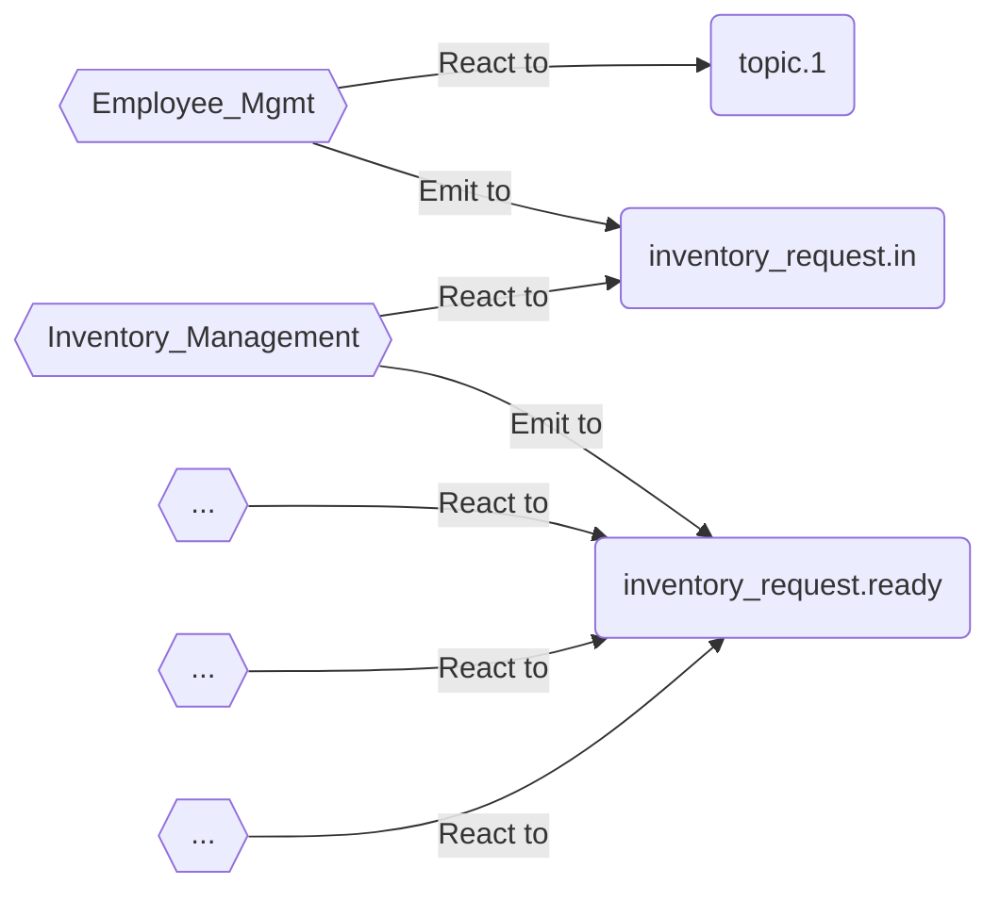

## Setup
Config your `.env` to match the parameters in `.env.example` from your cloud service provider or docker 
```
BROKER_HOST=
BROKER_PORT=
SASL_USERNAME=
SASL_PASSWORD=
SASL_MECHANISM=
SEC_PROTOCOL=
```
```
git clone https://github.com/SRVng/simple-microservice-kafka.git
cd simplpe-microservice-kafka
npm ci
npm run build
```

## Scripts
```
## inventory_prepare
npm run start:prepare
npm run start:prepare-input

## inventory_ready
npm run start:ready
```

## Description
This is part of CS621 Software Design and Architecture, Thammasat University
